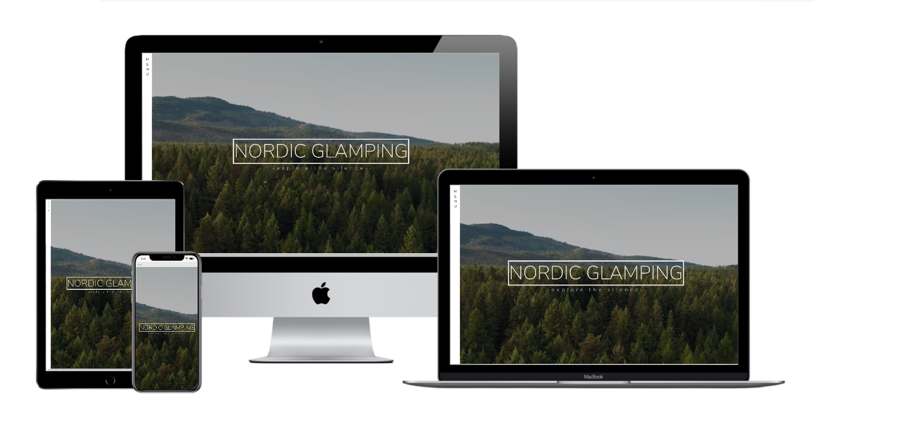
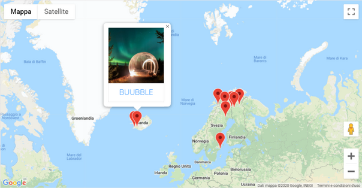
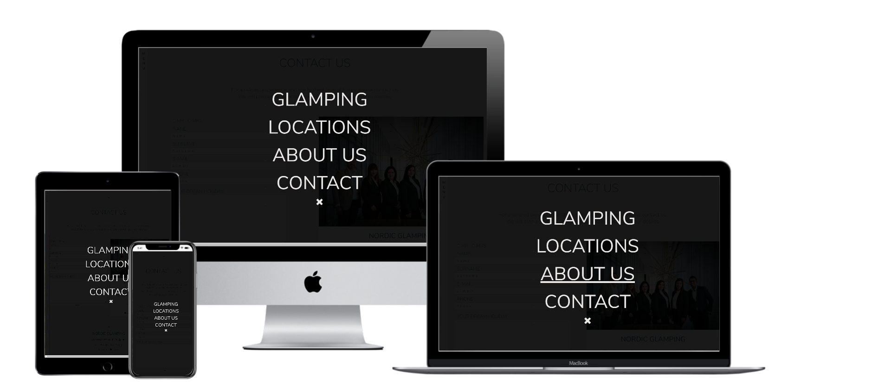
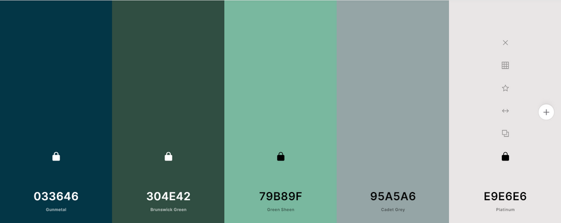
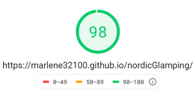
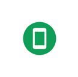

# Nordic Glamping

View the live project here. [Nordic Glamping](https://marlene32100.github.io/nordicGlamping/)

For the Second Milestone Project with the Code Institute, I have decided to design an interactive website for a fictional travel agency. The website, more specifically, is about the top locations for glamping in the Nordic countries.
The final user of the website is a wealthy person who is looking for a different kind of holiday, that combines the strengths of camping (being in contact with nature, outside urban areas) without giving up all the comforts of a 5 stars hotel. The fictional travel agency is specialized in luxury hospitality.
The website is a single page divided in five sections:

### [Landing Page](https://marlene32100.github.io/nordicGlamping/)

The landing page is very simple. There is a full screen video in the background with a view from above of a Nordic forest. The colours in the video are the same colours used throughout the website. A general feel of silence, open space, calmness, take immediately the user inside the purpose of glamping.
A title and a subtitle welcome the user, inviting him/her to navigate through the website with the words “explore the silence”. The user can click on this sentence and can go directly to the following section, which is “Glam and camping”, or can scroll down the page and reach the same section.
A fade in effect drives to user down to the website, with a smooth effect that is in line with the general sense of relax that the user is supposed to experience.

### [Glam and Camping](https://marlene32100.github.io/nordicGlamping/#information-section)

The second section is an introduction of what the purpose of this kind of holiday is.
There is a text and a image that briefly summarize both visually and with words what is a luxury camping experience, and for who it is for.

### [Map](https://marlene32100.github.io/nordicGlamping/#map-section)

In this section I have used the Google Maps API to display a map with the locations that the travel agency suggests.
Next to the map a brief description to invite the user to click on the map, or contact directly the agency for a more tailored experience.
The map shows the locations with markers; when the user click on one location, a info window is displayed with a image of the place and its name. Clicking on the window the user is re-directed to the home page of the glamping site on another tab. 
Clicking a second marker makes the first info window close, and opens the relative info window. In this way, only one information at a time is displayed and the user doesn’t get too much confused.

### [About us](https://marlene32100.github.io/nordicGlamping/#recommended-section)

This section shows all the sponsors or the magazines that promoted this fictional travel agency and their glamping project.
The six logos are displayed inside six circles and a text explains who those sponsors are.
This should convey a sense of reliability and security, so that the user doesn’t feel afraid to book a holiday with them.

### [Contact](https://marlene32100.github.io/nordicGlamping/#contact-section) 

The last section is the contact area. 
There is a contact form where the user can write his/her wishes for a perfect holiday, so the travel agency can contact them with a tailored offer.
Next to the contact form there is a card showing a picture of the people working in the office, and the contact details such as address, phone number and email.
The picture of the employees should add more sense of reliability and professionality.

### Footer 

A footer repeats the contact details, adding the links for the social media pages.

---

## User Experience (UX)

* **Strategy Plane**

This site displays only the best selection of locations in the Nordic countries for luxury glamping.
The purpose of the website is to entice people to choose this kind of vacation and then ask for more information.
It will also be possible for the user to ask for a tailored holiday experience, which is something that the ideal user is looking after.

According to researches, the majority of users that choose glamping are between 18-50 years old.
Usually they are people who live in a urban context, earn a medium-high salary, and that don’t want to give up comfort while at the same time enjoying nature.
The target of the website, however will be the age group 33-50. 

[Source-Grand View Research](https://www.grandviewresearch.com/industry-analysis/glamping-market)

[Source-Forbes](https://www.forbes.com/sites/loisaltermark/2018/08/28/american-glamping-association-launches-to-set-industry-standards-and-manage-customer-expectations/#4d3824d8632a)

The business wants to promote luxury glamping in the Nordic and let people book their holidays.
Ideally the website is owned by a travel agency.

The user with this website should find easily the best locations in the Nordic countries for high luxury glamping, and crave for more informations.

There are a few other websites about glamping in the Nordic countries:

[Glamping Hub](https://glampinghub.com/)

[Glamping-Holiday](https://www.glamping-holiday.com/glamping-sweden-all.html)

They both display a map with the location, with links to information pages.

Glampinghub is very functional, but in my opinion is missing a more exclusive graphic style.
Glamping-holiday has a very old graphic.
They both offer the chance to check the availability of the location for a specific date and they both are focused on glamping worldwide.

I think that they are missing a graphic which is more exclusive, but also branding and extra focus.

I want to focus only on the Nordic area, and only the most luxurious glampings: the graphic will also have a Scandinavian luxury feeling.

Images and design will play a very important role, because I want that the user gets the feeling that Nordic Glamping provides something exclusive and unique.

The website should also make clear that this kind of holiday is a solitary one: no other turists too close, not socialization areas, no nightlife. 
This feature is very important, considering that I am designing this website in the "covid-era": more people now wants to stay away from other people. I will not mention directly this because from a marketing point of view it can be a double-edged sword: not everyone want to associate in the mind sickness with holiday.

Navigation bar and map of the Nordic countries with markers on the locations will provide easily the tools for an easy, clear and fast navigation

The navigation is simple and clear. Javascript will help to deliver an extra touch with smoothness on scroll and adding extra features (Google Maps API, EmailJS).
The website will also have a clear syntax that allows users with screen readers to navigate easily.

From the point of view of the user, he/she is expecting to have a clear, consistent and professional graphic that allows to have in a glance informations about who is this travel agency, why is it reliable, where are the best locations and what do they offer.
The user, considering the target that the website aims to, is not interested in saving money, but in having a great experience.

To make the travel agency trustworthy, I will place logos of partners or testimonials in a “recommended by” section.

Google Maps API will help me placing a map with markers and info windows. 
Info windows will have a picture of the location, the name, and a link to another page where all the detailed informations are written.

The user will then be able to contatc the travel agency through a contact form, or a phone number, or also a e-mail address.

The user can also stay in touch with the agency connecting to their social medias.

The website is really focused on a specific topic and dedicated to a specific target.
All additions and improvements to this plan should always count towards the goals of the user and/or the business.

|   | Opportunity / Problem / Feature   | Importance    | Viability|
| :-: | --------------------------------- |:-------------:| :--------:|
| A | Find the locations on map | 5 | 4 |
| B | Find detailed info about every single location | 5 | 2 |
| C | Book the holiday directly from the website | 4 | 3 |
| D | Contact the website owner for info | 5 | 5 |
| E | Find info about reliability | 5 | 5 |
|   |  *Total* | *24* | *19* |

As shown from the table above, it will be possible to implement the features A, D and E, but B and C will require more time. The priority will be: E-D-A-B-C.

* **Scope Plane**

The website will include nice pictures of the accommodation and maybe of the surrounding area, then informations about all those luxury features that Nordic Glamping offers to their customers.

A presentation of the best location will be included in project (at least through info windows on the map), but the chance to book the holiday directly from the website will be left as last thing to implement. That means that maybe this feature will not be available in this release.

The travel agency needs a website that expresses its professionality, reliability and trustworthy. The agency wants to gain new clients, but also have a presence on the web.

The website must be a clear showcase of their brand, and to achieve this the agency wants a modern design with modern features.

* **Structure Plane**

The website is going to have a single page with different sections: informations, map, about us and contact.

A navigation bar (different for the mobile version and the desktop version) is going to be stuck on the top or on the left side, so that the user can move anytime on a different section without scrolling.

Links will change style on hover, so that a user knows that he/she can click on it for more content.

Links that lead to an external page (such as social medias or locations' websites) are going to open on a new tab, so the user will not lose the Nordic Glamping website.

Scrolling down the page the user will find a arrow icon pointed on the bottom, which can be clicked to reach the following section. The same icon, but pointed to the top, will be placed at the end of the page and it will allow the user to reach immediately the first section without scrolling.

A feedback will guide the user while filling the contact form. If the user write something in a format which is not correct, an alert will pop up remembering the correct format.
Also, when submitting the form, an alert will let the user know that the form has been correctly sent.

* **Skeleton Plane**

All the sections will have the same style (same background color, typography, similar percentage of space occupied by content). The design will be consistent and should leave a sense of breathe. Negative space has importance: the website must reflect the wide areas of nordic pristine forests, where nature is queen and silence is king. 

The [wireframes](wireframes/balsamiqWireframe.pdf) show my project.

_Working on the website I realized that it takes too long to design a page for each location: I will add this feature in a future release._

* **Surface Plane**

A source of inspiration for minimal design comes from an article on [UXPlanet](https://uxplanet.org/nordic-ux-what-minimalism-looks-like-scandi-style-6eebbce51d74).

The colour palette is inspired by the nordic forest and the fonts ("Montserrat" and "Nunito Sans") are a great combo to convey the idea of minimal modernity.

### User stories

#### First Time Visitor Goals
* As a First Time Visitor, I want to understand what glamping is and what the travel agency offers.
* As a First Time Visitor, I want to find the best locations for glamping in the Nordic countries.
* As a First Time Visitor, I want to ask for a tailored experience and get in touch with the travel agency.

#### Returning Visitor Goals
* As a Returning Visitor, I want to find out if there are new locations for glamping.
* As a Returning Visitor, I want to contact the travel agency.

#### Frequent User Goals
* As a Frequent User, I want to book my holidays.
* As a Frequent User, I want to phone or send a e-mail to the agency.                                    

### Design

For this project I decided to use a single page layout, playing with design.
The goal of the website is to show immediately the brand image of the travel agency and their glamping experience. 
It means that the user should feel from the very first second a sense of tranquillity, connection with the wild nordic nature and at the same time a sense of professionality and safety.
To achieve this, I used a minimal layout, but well planned in its details.

First of all, the landing page has a full screen video with a nordic forest shown from the above. The video divides the screen in two areas, a green one with the trees and a light gray one on the upper side.
Those colours give a sense of calmness, and have been used as leit-motiv for all the website.

Personality is shown also from the style of the menu navbar:
for smaller screens I decided to design three dots on the top-left of the screen, to suggest that in that place there is some extra features.
For bigger screens I designed a lateral menu on the left side, where the word "menu" is shown vertically.
Clicking on the menu, a full screen black opaque overlay is shown with the links to the different sections of the website.

I have used JQuery to achieve a deeper sense of calmness, using its fadeIn effect on scroll. The content of the website is shown smoothly appearing one after one.

While working on the website, in one section I changed title from "Recommended by" to "About us". However, I left the nomenclature "recommended" in the code because it would take too long to change it all over. This is important to keep in mind if in the future there will be the need to work on the code.

### Colour Scheme

Colour scheme image designed with [Coolors.com](https://coolors.co/)

The colour palette that I choose reminds of nature and silence. 
Throughout the website the colours are repeated, so that the user feels comfortable.
Hovering over links or on the contact form, repeats as well the same colour palette: I used a lighter shade of green as background color for the input fields in the contact form (#ddede7) because I felt that the other shades I have been using were visually too strong when applied on a larger area.
Basically I took the colour scheme of the video in the landing page and I adapted it to the website.
The background of the website is not white, but it is a shade of light gray. I think that this solution helps to convey a idea of softness and nature.

To help me with the choice of colours I used the website [Color-Hex](https://www.color-hex.com/)

### Typography

The font that I used are *"Montserrat"* and *"Nunito Sans"*. 
They are very modern and minimal and I think that they are perfect for a design that should remind of the Nordic countries.
I have played with different heights and letter spacing to add more character to the style.

### Imagery

For this project I used the full screen video and the final image of the employees from [Pexels](www.pexels.com).

The images of the locations in the info window have been taken from those websites:

[Ice Hotel](https://www.telegraph.co.uk/travel/destinations/europe/sweden/galleries/icehotel-winter-2019-2020-ice-hotel-in-swedish-lapland/);

[Tree Hotel](https://www.booking.com/hotel/se/treehotel.it.html?aid=356981;label=gog235jc-1DCAsoyAFCCXRyZWVob3RlbEgzWANoyAGIAQGYARS4ARfIAQzYAQPoAQGIAgGoAgO4AvqOqfsFwAIB0gIkNmY3YmUwYWYtNmIyNi00MDE0LTgyNDAtMzQzZjBjMGQ2MDBl2AIE4AIB;sid=5a82bd3c868caeb11a55846f2c8303a5;dist=0&keep_landing=1&sb_price_type=total&type=total&);

[Narvik](https://www.gites.fr/gites_narvik-adventures-as_narvik_h2411589_en.htm);

[Jeris Aurora Dome](https://www.booking.com/hotel/fi/jeris-aurora-dome.it.html?aid=356981;label=gog235jc-1DCAsoSEIRamVyaXMtYXVyb3JhLWRvbWVIM1gDaMgBiAEBmAEUuAEXyAEM2AED6AEBiAIBqAIDuALTkKn7BcACAdICJGYyNzhjMjc4LTZmN2ItNDEyYy04ZWNhLTUwNTQwMzhlY2Y1OdgCBOACAQ;sid=5a82bd3c868caeb11a55846f2c8303a5;dist=0&keep_landing=1&sb_price_type=total&type=total&);

[Torassieppi](https://www.pitchup.com/sv/campsites/finland/lapland/northern_lapland/saariselkae/torassieppi_jerisjaervi/);

[Levin]([https://www.designstack.co/2018/11/glass-igloos-hotel-resort-in-finland.html);

[Kakslauttanen](https://www.alux.com/wp-content/uploads/2014/03/hotel_kakslauttanen_finlandia_5589_1200x800.jpg);

[Reykjavik Domes](http://reykjavik-domes.hotels-reykjavik-is.com/it/#sunset-main-gallery-2);

[Buubbles Iceland](https://www.facebook.com/bubblesiceland/);

To avoid the website being too heavy to load, I used the website [Resize Image](https://resizeimage.net/) to crop and resize images.
Pictures used for info windows are 400x400px, and logos are 200x200px.

Logos have been taken from the web.

### Wireframes

I used Balsamiq to design the layout. 
You can view the document clicking [here](Wireframes/balsamiqWireframe.pdf).

### Features

The website has a clean layout with all the essential informations displayed both on smaller and larger screen.
There is a navigation bar, a footer with all the links to connect with the travel agency, a contact form, testimonials.
I have checked the responsiveness on all devices so that everything looks nice and clear.

The website is also fast to navigate; people usually don't want to spend too much time on a website looking for informations. 
Most of the time, also, people navigate from their mobile phones when they are (for instance) travelling on a bus, train, or in other situations where they don't have too much time.
The target of users that the website aims to, moreover, is usually wealthy people who rather prefers to pay money to have someone fixing problems for them, instead of wasting time trying to find the best solutions on their own.
That is the reason why the website is minimal, but at the same time gives all the infos needed.

I have used Javascript to validate the contact form; in this way mistakes are reduced and the user is guided throughout the filling.
Fields such as name/surname and phone number cannot be validate perfectly, since not everyone in the world uses the Latin alphabet or the same way yo write a phone number.
To reduce mistakes, I decided to validate name/surname accepting alphabet and special characters: in this way, also letters such as Å, Ä, Ö, just to name a few, can be validated.
Phone numbers accepts obviously only digits, with a minimum of 9. According to [O'reilly website](https://www.oreilly.com/library/view/regular-expressions-cookbook/9781449327453/ch04s03.html), the shortest phone number in the world has 7 digits.
Considering that the travel agency is supposed to be located in Sweden, someone who lives in another country and has a phone number of 7 digits is forced to enter also the country prefix (which is usually 2 digits).

When submitting the form, if the message is sent the form is also cleared. I did this adding a code inside the sendEmail.js script.

Other features are an interactive map that displays the best locations for glamping, and that shows in a clean and nice way the image of the location.
I used Bootstrap cards to customize the info windows, so it looks more consistent with the rest of the website and is also more pleasant to look at.

### Features to implement

In the future I would like to add a page for each location. This idea was in my original project, but it takes too much time: I will implement it in a second moment.
I will show for each locations a carousel of images, more details about the place and its facilities, reviews of other customers.
It would be nice to add the Booking.com API so that users can book their holidays from the Nordic Glamping website.

I would like also to change the style of the contact form, so that it looks more unique. I will place the label instead of the placeholder, then I will add icons that shows if a field is correctly validated, or not.

One more feature to add is a custom page 404. For instance, if a user write https://marlene32100.github.io/nordicGlamping/contact, a page 404 is displayed because the address is not correct. It would be nice if the page 404 had a graphic consistent with the design of the website and had a link to the home page of the website.

---

## Technologies Used

### Languages Used
* HTML5
* CSS3
* Javascript

### Frameworks, Libraries & Programs Used

* Bootstrap 4.5.0.
* Google Fonts
* Font Awesome 4.7.0.
* jQuery
* Git
* GitHub
* GitPod
* Chrome DevTools
* Lighthouse
* Techsini mockup generator
* Autoprefixer CSS
* Google Maps API
* EmailJS API
* Jasmine
* Wave
* Balsamiq
* Favicon.ico

---

## Testing

### Functionality Testing 

All the links have been checked and they all are working.

The form fields have also been checked by me and some testers. The fields are correctly validated and the message is sent properly.

A problem I found is that the form is submitted also if the message texarea does not fulfill the requirements I wrote on my code (at least 70 char).

The alert immediately tells the user that he/she should add more details if the text is too short, but the form is submitted anyway.

This will not affect the user experience, but it will affect the owner's side because too many emails can be sent with a text that might be too short.

To prevent this, I added a checkbox which adds one more step before clicking the submitting bottom.

Html and Css have been validated with [HTML Validator](https://validator.w3.org/) and [CSS Validator](https://jigsaw.w3.org/css-validator/).

I tested Javascript while compiling using console.log to check if I was coding properly.

I used Jasmine to write tests before coding for the contact form validation. You can view my tests here: [Jasmine Testing Scripts](testing/scripts) and [Jasmine Testing Specs](testing/specs).

I had to fix further the validation code because when applied to the form didn't perform always as expected. So I added manual testing until the code worked out as I wanted.

In the beginning, I wanted to show a fade in effect when the content was visible in the viewport. To achieve that, I wrote a code that takes as parameter the height of the viewport in relation to the height of the content.

I was expecting the content to fade just once, but it turned out that the content was fading all the time whenever a scroll was detected.

To reach a similar intent without spending too much time, I simply added a JQuery fadeIn effect with a delay; in this way the content now fades in after the first scroll, one after another, from the first section to the last.

It is not what I initially wanted to, but the effect is smooth and nice.

Anyway, I would like to implement the code I had in mind in the beginning on a future release.

I had a problem on the map with info windows. My code opened one info window at a time, but the content displayed inside was always the same repeated for all the locations. Basically, my code took the informations only from the last object in the array "locations".

I asked help to the Tutor Service of Code Institute and Stephen Moody kindly suggested to read the article at this [page](https://www.tutsmake.com/add-show-multiple-markers-pins-on-google-map/). I then created a new variable where I set all the info window contents, so that each content had the same index of the relative location in the variable "locations". At this point, it was easy to link the two.

### Usability Testing

To test the usability I tried myself the website on multiple devices and using Chrome DevTools, but I also asked my family and the Slack community to view it.

According to people who tested the website, it is easy to navigate and the typography is legible.

All the images have the "alt" text.

I tested the website with [Wave](https://wave.webaim.org/) to check if something can be improved in terms of accessibility.
I used in the website some icons as links (the "scroll down" icons and the social media icons) and this can be a problem for people who use a screen reader.
Screen readers need text as links, not icons.
The [survey on screen readers 2019](https://webaim.org/projects/screenreadersurvey8/) shows that the majority of people using a screen reader is blind; that means that using icons as links can be a real issue for them.
However, the sticky navigation bar allows to skip through sections also without clicking on the "scroll" icons.
It could be a little trickier to find the links for social medias, but before the icons I wrote "connect with us:". This could be a little hint.

Another issue with accessibility is that I skipped some heading levels: for instance, on the landing page I used "h1" for "Nordic Glamping", and "h3" for "-explore the silence-". Users with screen readers can get confused.
This is something that I will have to fix.

I fixed some issues with responsiveness and ux in the infowindows: on smaller screens they were too big, so I added some media queries to fix that.

Also with the contact form I had some issues displaying nicely between 992 and 1060px, so I added some media queries and fixed the width.

### Compatibility Testing

I tested the website on multiple browsers:
* Chrome
* Edge 
* Firefox
* Internet Explorer
* Safari
* Opera

I tested also on multiple devices with Google DevTools.

### Performance Testing

I tested the website with [Google PageSpeed Insights](https://developers.google.com/speed/pagespeed/insights/) and the result was very good for desktop devices, a little less for mobiles.

In the future I can resize the images for mobile devices, so it takes less to upload.

I tested further with [Google Test Mobile Friendly](https://search.google.com/test/mobile-friendly) and the result was really good. The website performs well on mobile phones.

After testing with Lighthouse in Chrome DevTools, I added rel="noopener" to the external links to improve security.

### Bugs

A known bug is that sometimes scrolling fast to the top of the page, the text "Nordic Glamping - explore the silence" from the landing page section is visible for a few seconds when the screen reaches the "glam and camping" section.

The contact form does not fade in on scroll.

---

## Deployment

### GitHub Pages

The website has been deployed following these steps:
* Log in into GitHub;
* Click on the repository you need to deploy;
* Go on "Settings";
* Scroll down the page until you find the "GitHub Pages" section;
* On "source"click on "none";
* Select "master branch" from the dropdown menu;
* The page will re-load automatically;
* Scroll down again to the same section "GitHub Pages";
* Now you will find a link that says "Your site is published at ..."

### Fork the code

If you need to work on this code on your own, follow these steps:
* Log in to GitHub;
* Find the repository you are looking for;
* On the top-right of the page you will find a button with the name "Fork";
* Click on it and it will automatically fork the code to your GitHub.

### Local Clone

To make a local clone of the site, just follow these stepsg:
* Log in to your GitHub;
* Under your repository section, select the repo that you need;
* You will find a green button with the name "Code". Click on it;
* On the dropdown selection, you will find a link to clone the code with HHTPS;
* Now open Git bash;
* Open the directory where you want to work on the cloned code;
* Type git clone followed by the link you have previously copied.

Done!

---

## Credits

### Code

Regex code `^[^±@£$%^&*_+§¡€#¢§¶•ªº«\\/<>?!:;|=.,]$` to validate names comes from [Salesforce Stackexchange.com](https://salesforce.stackexchange.com/questions/41153/best-regex-for-first-last-name-validation). This is the best way I found to help validating names, considering that not everyone uses a Latin alphabet.

Regex code `/^[\w-\.]+@([\w-]+\.)+[\w-]{2,4}$/` to validate emails comes from [Regexr.com](https://regexr.com/3e48o).

### Media

Please check the section **"Imagery"** on this document to find out the sources for pictures and video.

### Acknowledgements

My mentor Spencer Barriball for his support.

Stephen Moody from Code Institute for his help.

